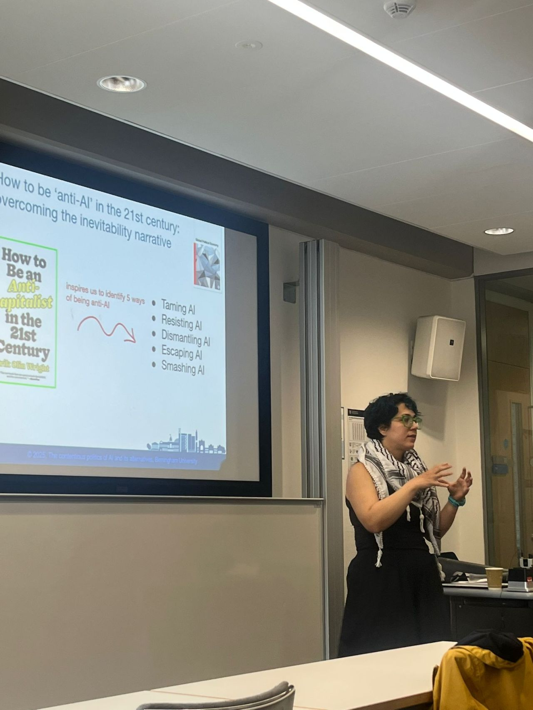

# The Contentious Politics Of AI Network
We aim to research, study, and make visible (and possible) ways that AI is, and can be, challenged. This might include institutional challenges, through party politics and public policy, but also non-institutionalised routes, such as online campaigns, protests and demonstrations, industrial disputes and strikes, or more direct efforts to create alternatives to AI. This network is a place to announce talks and research initiatives, organises actions, and facilitate discussions on challenging AI.

## About Our Network

**Who, what, why. Describe our mission. Introduce the problem. Mention the workshop.**

Lorem ipsum dolor sit amet, consectetur adipiscing elit. Nulla tellus velit, bibendum non lacus quis, rhoncus fringilla est. Pellentesque habitant morbi tristique senectus et netus et malesuada fames ac turpis egestas. Proin id bibendum odio, eget euismod tortor. Duis ultricies nisl nisi, sed viverra neque faucibus id. Nullam dapibus diam velit, sit amet dictum mi bibendum quis. Vestibulum blandit elementum orci, vitae pretium magna. Vestibulum ante ipsum primis in faucibus orci luctus et ultrices posuere cubilia curae; Nam gravida enim eu viverra pretium. Hello

  

## Research

**Talk about our research aims and objectives. Link to David and Iran's papers. Explain some of the research that has already been done. Forthcoming special issue etc.**

Lorem ipsum dolor sit amet, consectetur adipiscing elit. Nulla tellus velit, bibendum non lacus quis, rhoncus fringilla est. Pellentesque habitant morbi tristique senectus et netus et malesuada fames ac turpis egestas. Proin id bibendum odio, eget euismod tortor. Duis ultricies nisl nisi, sed viverra neque faucibus id. Nullam dapibus diam velit, sit amet dictum mi bibendum quis. Vestibulum blandit elementum orci, vitae pretium magna. Vestibulum ante ipsum primis in faucibus orci luctus et ultrices posuere cubilia curae; Nam gravida enim eu viverra pretium.

## Events and Activities

We are organising a series of talks that will happen monthly. Dates and speakers will be added to the list below and posted to our mailing list as we arrange them. We are hoping that our workshop will happen annually, check back here for details. Any other events or opportunitues will also be added here and announced in our mailing list.

### Monthly Talks
+ **November 15th 2025** - person -  title of talk

### Other Events and Opportunities

Nothing currently upcoming.

## Join The Network

Whether you are an academic, a policy researcher, a trade unionist, or an activist, if you have an interest in pushing back against AI then we want you to get involved. 

We have a mailing list to keep up with announcements, events, and research opportunities.

[Sign Up Here](https://www.jiscmail.ac.uk/cgi-bin/wa-jisc.exe?A0=CONTENTIOUS-AI-POLITICS)

## Reading List
We've compiled a list of books and papers on why and how we should contest AI. Let us know if you come accross any that you think we should include.

### Books
+ Bonini, T., & Treré, E. (2024). Algorithms of resistance: The everyday fight against platform power. Mit Press.
+ Hao, K. (2025). Empire of AI: Inside the reckless race for total domination. Random House.
+ McQuillan, D. (2022). Resisting AI: An anti-fascist approach to artificial intelligence. Policy Press.
+ Merchant, B. (2023). Blood in the machine: The origins of the rebellion against big tech. Hachette UK.

### Papers
+ Mansouri, M. I., & Bailey, D. J. (2025). How to be ‘anti-AI’in the 21st century: overcoming the inevitability narrative. Global Political Economy, 1-10.

### Contact

If you have any questions or want to get involved, email Dr Gary Smith at contestingainetwork@gmail.com
