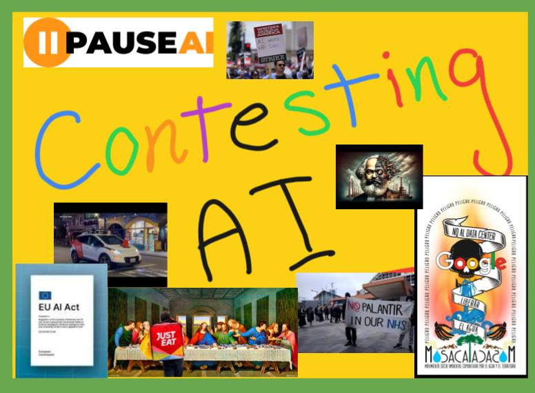
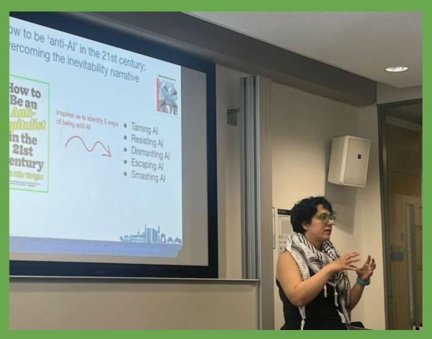
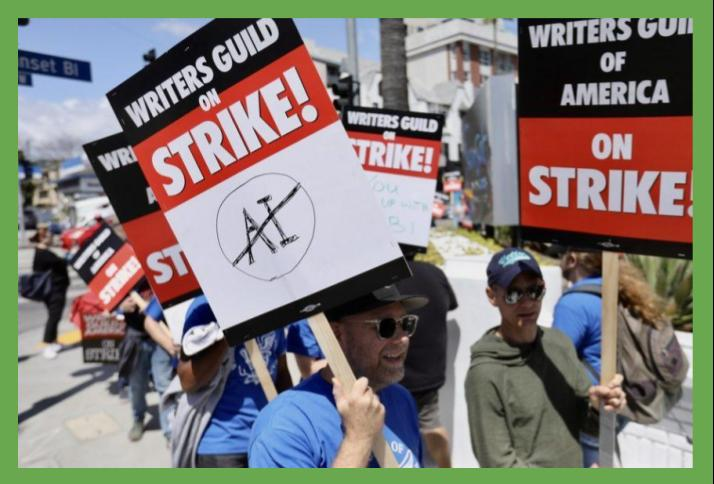



# The Contentious Politics Of AI
Our network offers a space for those who want to research, study, and make visible (and possible) ways that AI is, and can be, challenged. It is open to all -  academics, policy researchers, and activists interested in ways that AI is contested - see details below on how to sign up.

  

    
    
<strong>Aims of the Network</strong> At our founding conference in July 2025 we launched the network in order 
      <a href="{{ site.baseurl }}/aim-of-network.html">Read more</a>
    

  

  

    
    
<strong>Monthly Talks</strong> Our monthly talks are typically held on the third Wednesday of each month. 
      <a href="{{ site.baseurl }}/monthly-talks.html">Read more</a>
    

  

    
    
<strong>Contestation updates</strong>  We have a running update in newsletter form of the different types of contestation as they happen and are reported. 
     <a href="{{ site.baseurl }}/news.html">Read more</a>
    

  

## Join us!

Whether you are an academic, a policy researcher, a trade unionist, or an activist, if you have an interest in pushing back against AI then we want you to get involved. 

We have a mailing list to keep up with announcements, events, and research opportunities, and where will also provide a regular newsletter updating on recent episodes, campaigns and events focused on the contestation of AI.

[Sign Up Here](https://www.jiscmail.ac.uk/cgi-bin/wa-jisc.exe?A0=CONTENTIOUS-AI-POLITICS)

## Suggested Readings
Some initial readings that we think are useful on why and how we might contest AI (we'll keep this updated).

+ Bonini, T., & Treré, E. (2024). [Algorithms of resistance](https://direct.mit.edu/books/oa-monograph/5721/Algorithms-of-ResistanceThe-Everyday-Fight-against): The everyday fight against platform power. Mit Press.
+ Hao, K. ([2025](https://www.penguin.co.uk/books/460331/empire-of-ai-by-hao-karen/9780241678923)). Empire of AI: Inside the reckless race for total domination. Random House.
+ McQuillan, D. ([2022](https://bristoluniversitypress.co.uk/resisting-ai)). Resisting AI: An anti-fascist approach to artificial intelligence. Policy Press.
+ Mansouri, M. I., & Bailey, D. J. ([2025](https://bristoluniversitypressdigital.com/view/journals/gpe/4/2/article-p185.xml)). How to be ‘anti-AI’in the 21st century: overcoming the inevitability narrative. Global Political Economy, 1-10.
+ Merchant, B. ([2023](https://www.hachette.co.uk/titles/brian-merchant/blood-in-the-machine/9780316487740/)). Blood in the machine: The origins of the rebellion against big tech. Hachette UK.
+ Moore, P. V., Ernst, E., Donoghue, R., and Bloom, P. ([2025](https://bristoluniversitypressdigital.com/view/journals/gpe/4/2/article-p195.xml)). Artificial Intelligence Policy Observatory for the World of Work (AIPOWW) Symposium Editorial. Global Political Economy 4, 2, 195-200

## Affiliated critical AI networks

We are also working together with the following critical AI networks:
+ [Critical Studies in AI and Digitalisation Cluster (CSAID)](https://www.essex.ac.uk/centres-and-institutes/commons-organising-values-equalities-and-resilience/csaid), University of Essex
+ [The Critical AI Centre (CrAIC)](https://cdf.exeter.ac.uk/communications/research/centres/craic/), University of Exeter

### Contact

The Contentious Politics Of AI network is coordinated by [David J. Bailey](https://www.birmingham.ac.uk/staff/profiles/gov/bailey-david) (University of Birmingham), [Masoumeh (Iran) Mansouri](https://www.birmingham.ac.uk/staff/profiles/computer-science/academic-staff/masoumeh-mansouri) (University of Birmingham), and [Gary Smith](https://www.linkedin.com/in/dr-gary-smith-mbcs/) 

If you have any questions or want to get involved, email us at contestingAInetwork@gmail.com
